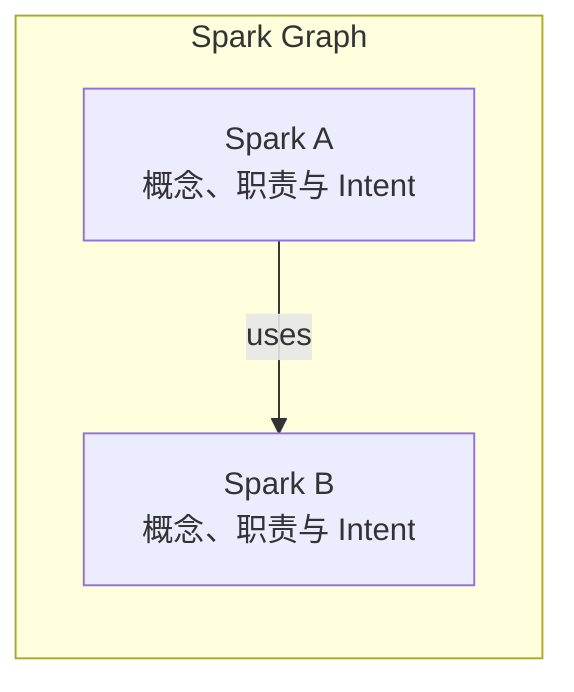

# SparkWell：AI Coding 之上的软件模型层

SparkWell 的核心想法很简单：

> **在 Code 之上，增加一层更高层的软件模型：Spark Graph。**

这里的“软件模型”指可阅读、可评审的软件设计，不是大语言模型（LLM）。Intent 指希望软件表达的行为、职责及其背后的设计意图。

Spark 是比 Class、File、Function 更高层的抽象，用来表达一个值得独立理解的软件概念，以及它背后的 **Intent**。

多个 Sparks 及其关系组成 **Spark Graph**：



Spark Graph 是比具体代码更高层、更稳定的软件表示。它描述 Concept、Intent 和 Relationship，而具体 Implementation 可以有多种。

---

## 与直接生成代码的流程相比

以从需求直接生成代码的方式为例：

```text
Requirement
    ↓
Agent
    ↓
Code
```

人往往直接 Review 最后的 Implementation。

SparkWell 希望变成：

```text
Requirement
    ↓
Agent
    ↓
Spark Graph
    ↓
Human Review / Modify / Refine
    ↓
Code
```

也就是说，在真正生成大量代码之前，先让 Agent 把对需求的理解转化成一个高层的软件模型。

工程师可以先 Review：

- 软件应该由哪些重要 Concept 组成；
- 每个 Concept 负责什么；
- 它们之间是什么关系；
- 关键设计 Intent 是否正确。

如果设计有问题，可以直接修改 Spark Graph，而不是等大量代码生成以后再从 Implementation 中发现问题。

确认以后，再由 Agent 依据 Spark Graph，结合目标平台和已有工程生成或修改代码。后续需求变化时，也回到这份设计讨论和更新。

设计评审本身并不新。SparkWell 尝试把确认后的设计持续维护下来，让它成为后续修改和不同实现的共同依据，而不只是某次代码生成前的一份计划。

---

## 为什么需要这一层？

AI 让 Code Generation 越来越便宜，但人理解和 Review 大量生成代码的速度并没有同步提高。

SparkWell 希望把 Review 的一部分从：

```text
Review thousands of lines of code
```

提升到：

```text
Review the software model first
```

代码仍然需要 Review 和测试，但 Engineer 可以先在更接近自己 Mental Model 的层面确认：

> **“这个软件是不是按照正确的方式被理解和设计了？”**

---

## 同一份 Spark 设计，可以有多个实现

Spark Graph 保留相对稳定的软件概念、Intent 和重要设计决定，不要求所有实现都使用同一种技术。

因此同一个 Spark Graph 可以支持不同实现：

```text
              Spark Graph
           /       |        \
          ↓        ↓         ↓
        Web       iOS     Android
```

当前 Todo Demo 已有 React Web 和原生 SwiftUI iOS 实现，共用同一份 Spark Graph。图中的 Android 是可探索的扩展方向，不是当前 Demo 已有的实现。

例如同一个 `Todo Editor` Spark 可以由两端分别实现，而不需要重新描述其核心行为。这里复用的是设计，不要求共享 UI 代码，也不意味着自动保证两端行为一致。

---

## 一句话总结

> **SparkWell 在 Requirement 和 Code 之间增加一层可理解、可 Review、可复用的 Spark Graph，让 Engineer 先 Review 软件设计和 Intent，再让 Agent 生成具体实现。**

它希望解决的不是“怎么让 AI 写更多代码”，而是：

> **当 AI 越来越会写代码以后，人如何继续掌握软件本身。**

这是一个仍在验证的方法实验。进一步的分析见[软件工程方法思考](SparkWell：AI%20Coding%20时代的软件工程方法思考.md)，也可以直接看其中的 [Todo Demo](SparkWell：AI%20Coding%20时代的软件工程方法思考.md#10-todo-demo)，了解从需求、设计、多端实现到增量修改的完整过程。