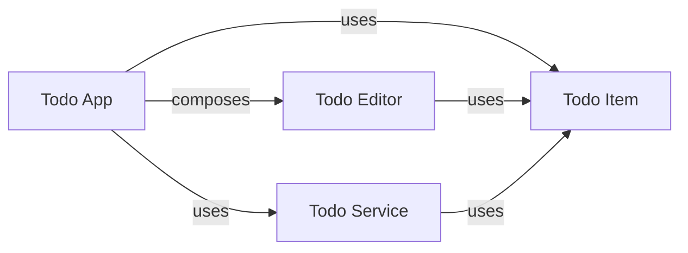

# SparkWell：AI Coding 时代的软件工程方法思考

> **关于软件理解、设计意图（Intent）、评审（Review）与持续演进的一次实验**

本文展开方法与待验证的问题。简要介绍见[极简版](SparkWell：AI%20Coding%20时代的软件工程方法思考%20（极简版）.md)；想先看实际过程，可以直接读[第 10 节 Todo Demo](#10-todo-demo)。
既有项目的模型来源、可信范围和增量演进，另见 [Brownfield 讨论](SparkWell：Brownfield、Descriptive%20Spark%20与%20Generative%20Spark%20的完整结论.md)。

## 1. AI Coding 正在改变软件工程

过去几年，AI Coding 的能力提升很快。

从代码补全，到现在能够独立完成较大任务的 Coding Agent，软件开发越来越常见这样的流程：

```text
Requirement
    ↓
Coding Agent
    ↓
Code
```

随着大语言模型（LLM）和工具能力继续提升，**Code Generation 的成本有望进一步下降**。

这带来一个新的软件工程问题：

> **当 coding 越来越 cheap 时，软件工程的主要瓶颈会转移到哪里？**

一个越来越明显的变化是：

> **代码的生产速度正在超过人理解代码、Review 变化和建立系统 Mental Model 的速度。**

SparkWell 是围绕这一变化展开的一次软件工程方法实验。

---

## 2. 当前 AI / Vibe Coding 的一些问题

AI Coding 显著提高了 Implementation 的生产效率，但当前常见的工作方式也暴露出一些新的问题。

### 2.1 Knowledge 是临时的

典型过程通常是：

```text
Requirement
    ↓
Conversation / Prompt
    ↓
Agent
    ↓
Code
```

任务结束后，长期留下来的主要是代码。

而大量重要信息仍然停留在临时 Context 中：

- 为什么采用当前设计；
- 曾考虑过哪些方案；
- 哪些行为是刻意设计的；

等等，结果往往是：

```text
Context disappears
Intent fades
Code remains
```

后续工程师或 Agent 需要重新从 Implementation 中恢复这些信息。

---

### 2.2 人的理解速度跟不上代码生成速度

传统软件开发通常经历：

```text
理解需求
    ↓
设计
    ↓
实现
    ↓
调试
    ↓
修改
```

虽然这个过程较慢，但实现本身也是建立系统理解的过程。

工程师在实现中逐渐掌握：

- 软件由哪些重要部分组成；
- 各部分承担什么职责；
- 数据和状态如何变化；
- 不同部分如何依赖；
- 为什么选择当前设计。

过去：

```text
Implementation Work
        ↓
Software Understanding
```

AI Coding 正在弱化这种天然联系。

当 Agent 一次修改大量文件和代码时，即使编译成功、Tests 通过、最终行为符合预期，仍然存在一个问题：

> **Engineer 是否真正理解这次 Change？**

Code Generation bandwidth 在增长，而 Human Comprehension bandwidth 并没有同步增长。

---

### 2.3 Implementation 更容易成为 Black Box

AI 生成的代码并不是天然的黑盒。

问题在于，开发流程越来越可能变成：

```text
Describe the task
       ↓
Agent changes implementation
       ↓
Tests pass
       ↓
Validate the result
```

工程师的角色可能逐渐从：

```text
Builder
```

转向：

```text
Requester + Validator
```

于是可能出现：

> 需求是清楚的，结果也是正确的，但 Implementation 本身并没有形成完整的 Human Mental Model。

对于一次性软件，这未必是问题。

但对于长期维护的软件，会直接影响：

- Code Review；
- Debugging；
- Reliability；
- Architecture Evolution；
- Risk Assessment；
- 后续修改。

---

### 2.4 Software Knowledge 没有被很好地复用

很多 AI Coding interaction 本质上仍然是：

```text
Prompt
Prompt
Prompt
```

相同的软件知识可能在不同场景中反复被解释：

- 新的 Agent Session；
- Web Implementation；
- iOS Implementation；
- Android Implementation；
- 后续 Feature；
- Refactoring。

过程不断重复：

```text
Explain
Infer
Reconstruct
Repeat
```

Software Knowledge 仍然主要作为一次性输入存在，而不是长期资产。

---

### 2.5 Engineer Expertise 没有充分沉淀

传统软件工程中，Senior Engineer 的经验通常通过：

- Architecture；
- Design Review；
- Code Structure；
- Patterns；
- Code Review；
- Mentoring；

持续进入系统和团队。

Agent-centric workflow 可能逐渐变成：

```text
Engineer
    ↓
Instruction
    ↓
Agent
    ↓
Implementation
    ↓
Validation
```

很多 Engineering Judgment 最终只存在于某一次 Prompt 或 Review 中，没有成为长期、可复用的软件知识。

长期来看，知识传递也可能发生变化：

```text
Engineer ↔ Agent
Engineer ↔ Agent
```

而传统的：

```text
Engineer → Engineer
```

可能逐渐弱化。

理想情况下，AI 应该放大 Engineer Expertise，而不是仅仅消费 Expertise 来生成一次性的 Implementation。

---

### 2.6 代码能运行，不代表设计符合预期

AI 给出的方案可能看起来合理，却在职责边界、状态管理或失败处理上作出与我们预期不同的决定。例如，“保存失败是否保留输入”没有先说清，正常流程能跑通，失败后的体验却可能完全不同。

需要评审的不只是代码有没有正确执行，也包括 AI 对需求的理解和设计是否合适。把这些决定放在大量实现之前讨论，可以更早发现分歧；这不替代后续的代码评审和测试。

---

## 3. Code 不应该是 AI Coding 唯一沉淀下来的资产

上述问题有一个共同特征：

```text
Ephemeral Knowledge
        ↓
      Agent
        ↓
Persistent Code
```

Requirement、Context、Reasoning、Intent 和 Engineering Judgment 大量是临时的。

真正长期保留下来的主要是 Implementation。

SparkWell 的一个基本判断是：

> **Code 不应该成为 AI Coding 唯一持久的软件资产。**

还应该长期保存：

- 重要的软件概念；
- Concept 之间的关系；
- 设计 Intent；
- 稳定的行为和约束；
- Engineering Judgment。

因此，需要从：

```text
Generate Code
```

进一步走向：

```text
Maintain Software Knowledge
        +
Generate Implementation
```

---

## 4. SparkWell：维护一层 Human-oriented Software Model

SparkWell 的基本思想是：

> **在代码之外，维护一层长期存在、面向人的软件认知模型。**

这里的 Model 指 Spark 设计模型，不是 LLM。它描述产品行为和重要的软件设计决定，帮助人形成对系统的整体理解，而不是要求人记住每一行代码。

它不替代代码，而是与 Implementation 并存：

```text
Human-understandable Software Model
                ↕
          Implementation
```

这层 Model 不以每个 Function、Class 或 File 为主要组织单位，而围绕工程师真正需要理解的软件概念组织。

这些概念称为 **Spark**。

例如：

```text
Todo Editor
Todo Service
Conversation State
Response Processing
Synchronization
```

一个 Spark 表示：

> **一个值得作为整体理解、讨论、Review 和修改的软件概念。**

当前用 Markdown 文档保存这些知识，用少量 YAML 元数据记录身份和关系。维护的是当前已确认的设计，不是所有聊天内容；历史和被否决的方案继续通过 Git、PR、Issue 等追溯。

Spark 既可以从需求讨论形成，也可以从既有实现中提炼重要语义，经评审后成为当前设计基线。
模型可以只覆盖软件的一部分，但必须对声明范围诚实、可信，明确未交付目标和未知内容。

设计评审和设计文档本身并不新。SparkWell 尝试把这份设计接入持续开发：`/spark-design` 讨论并维护相关 Sparks，确认后由 `/spark-impl` 据此实现。项目 instructions 和 Skills 说明怎么工作，Spark 保留这个项目已经决定做什么、由谁负责。能否比现有做法更有效，仍需要实际验证。

对已有实现，Agent 结合当前模型、获准的修改请求、相关配置和映射、已有代码及工程约定做增量修改。
不影响已维护的设计语义时，可以只改实现，不制造 Spark Diff。
模型未描述与本次任务无关的细节，不应阻塞现有代码的局部修改；缺少本次必需的语义决定时，才暂停受影响的工作并澄清。

---

## 5. Spark Graph：按人的理解方式组织软件

Spark 不是孤立文档。

Sparks 以及它们之间的关系共同组成 **Spark Graph**。

完整的 Todo 关系图见第 10 节。对于聊天系统，人理解的重要概念可能是：

```text
Conversation
      ↓
Response Processing
      ├── Streaming
      ├── Tool Execution
      └── Error Recovery
```

而实际 Source Tree 可能是：

```text
components/
hooks/
stores/
services/
reducers/
utils/
```

两者解决的是不同问题：

> **Code Structure 服务于 Implementation。**  
> **Spark Graph 服务于 Human Understanding。**

因此：

```text
Code Structure
    ≠
Human Cognitive Structure
```

SparkWell 维护的是一张 **Human-oriented Software Model**，而不是 Source Tree 的另一种描述。

---

## 6. Intent 如何保存在 SparkWell 中

Intent 主要保存在 Spark 及 Spark Graph 中。

例如 Todo Editing 的设计要求：

> 编辑过程中不直接修改已保存的 Todo。  
> Save 提交修改，收到服务成功结果后才更新列表。  
> 没有等待保存结果时，Cancel 可以丢弃修改。  
> Save 失败时保留用户输入。

在代码中，这些行为可能分布于界面组件、状态管理、服务访问和测试中。理解一个完整行为往往需要把这些位置联系起来。

SparkWell 则可以在负责这项行为的 Spark 中保留设计。以 Todo Editor 为例，下面是其行为的简化表达：

```markdown
# Todo Editor

Draft changes do not modify the saved Todo.

- Save validates and submits the draft; the App performs the service call.
- While saving, prevent repeated submission and dismissal.
- A successful result closes the editor; a failure keeps the draft for retry.
- When no save is pending, Cancel discards the draft without submitting it.
```

草稿属于 Todo Editor，字段规则归 Todo Item，服务调用由 Todo App 协调，实际保存归 Todo Service。Spark Graph 关联这些职责，不需要把每个状态或操作都拆成独立 Spark。

两者承担不同职责：

```text
Spark / Spark Graph

What does this concept mean?
Why does it work this way?
Which concepts matter?
What should remain true?


Implementation

How is it realized right now?
```

Code、Comments 和 Tests 同样可以表达一部分 Intent。

SparkWell 的核心观点不是“Code 无法表达 Intent”，而是：

> **Implementation 不是 Intent 最稳定、最容易复用和理解的载体。**

Implementation 可以被重构或替换，而 Concept 和 Intent 仍然可以持续存在。

---

## 7. Model Once, View Many Ways

Spark Graph 是 Model，但 Graph Visualization 只是其中一种 View。

同一个 Model 可以根据不同问题投影为不同视图。

这里的“Once”指同一份知识只维护一处，不是只设计一次。以下是可探索的视图方向，不代表当前 Demo 已经提供自动生成全部视图的工具。

### Spark Relationship View

```text
Conversation
      ↓
Response Processing
      ├── Streaming
      └── Tool Execution
```

用于理解系统中的主要 Concept 及其关系。

### Data / ER View

```text
User
 │
 ├── Todo
 │     └── TodoTag
 │
 └── Profile
```

用于理解数据结构和关系。

### UI Flow View

```text
Todo List
    ↓ Add
Todo Editor
    ↓ Save
Todo List
```

### Mock UI

UI Knowledge 可以进一步用于生成或展示 Mock UI。

### Implementation View

```text
Todo Editor Spark
        ↓
Web Implementation
        ↓
TodoEditor.tsx
useTodoDraft.ts
```

因此：

> **Graph 是 Model，不是唯一的 View。**

核心原则是：

> **Store once, view many ways.**

---

## 8. Model Once, Realize Many Ways

同一个 Model 也可以支持不同 Implementation。
能否从零启动某个新实现，需要结合目标、范围、模型内容和实现配置判断，不要求每个 Spark 都足以生成任意平台。

例如同一个 `Todo Editor` Spark 可以分别实现为：

```text
Todo Editor Spark
      │
      ├── Web: React
      ├── iOS: SwiftUI
      └── Android: Jetpack Compose
```

其稳定的软件概念和行为无需在每个平台重新描述。

当前 Todo Demo 包含 Web 和 iOS；Android 是扩展方向，不是已完成的实现。

同样，一个 API Service Spark 可以成为多个产物的共同设计来源。例如，结合相关 Data Spark，同一份 Todo Service 设计可以用于：

```text
Todo Service Spark
    │
    ├── OpenAPI contract
    ├── Node.js server
    ├── TypeScript service client
    └── Swift service client
```

不同实现需要保留已确认的行为、职责和数据生命周期承诺。更换技术或服务提供方如果改变了这些承诺，就需要重新讨论设计，不能仅当作实现替换。

因此：

```text
                Spark Graph
               /           \
              /             \
        Many Views       Many Realizations
```

可以概括为：

> **Model once, view many ways, realize many ways.**

---

## 9. SparkWell 可能带来的改进

如果这一模型成立，可以带来几类改进。

### 更快建立系统 Mental Model

先理解：

- 系统有哪些重要 Concept；
- 各自负责什么；
- Concept 之间如何关联；

再进入具体 Implementation。

---

### 提升 AI-generated Change 的 Review 效率

Review 不再只有：

```text
Large Code Diff
```

还可以先从 Concept Level 判断：

```text
Which Sparks changed?
Which Intent changed?
Which related concepts should be inspected?
```

然后再进入具体 Code Review。

当前的 [Spark Review](.github/skills/spark-review/SKILL.md) 可以按指定版本、实现和行为范围对照模型声明与代码，报告有证据支持、可能冲突、明确未交付或证据不足。
它只读审阅，不自动修改任何一方，也不证明整体正确。
发现差异后，需要结合证据决定修复实现、修正模型还是澄清范围；审阅不替代测试和运行验证。

---

### 保存长期 Intent

重要的设计知识不再只存在于一次性的：

```text
Chat
Prompt
PR
Meeting
```

而可以进入当前 Software Model。

---

### 提升 Software Knowledge Reuse

Spark Graph 可以在：

- 不同 Agent Session；
- 不同 Platform；
- 不同 Implementation；
- 后续 Feature；
- Refactoring；

之间持续复用。

---

### 保持 Mental Model 的连续性

Implementation 会持续演进，但稳定的 Conceptual Model 可以继续存在。
已有实现默认保留结构和无关行为，只做获准修改所需的变化。

因此：

> **Implementation 可以快速演进，而 Human Mental Model 不必反复从零重建。**

---

### 沉淀 Engineer Expertise

Engineering Judgment 可以从一次性的 Agent Interaction 转变为长期知识：

```text
Engineer Expertise
        ↓
   Spark Graph
        ↓
Future Engineers + Future Agents
```

---

## 10. Todo Demo

`SparkWellDemo` 用一个简单的 Todo 应用验证这套过程。业务足够简单，可以把注意力放在设计如何被理解、复用和修改上。

下面链接的 Sparks 和源码都来自当前仓库，已经包含 `createdAt` 的增量修改。为了说明过程，先从不包含创建时间的初始功能讲起。

### 10.1 从需求到四个 Sparks

初始功能需求可以概括为：

> 做一个 Todo 应用，列表显示任务、描述和状态，支持弹窗新建和编辑。  
> 任务必填，最多 300 字符；描述可空，最多 1,000 字符。  
> 状态为未完成或已完成，新建默认未完成。编辑器提供保存和取消。

把需求交给 `/spark-design` 后，先讨论设计：未保存的输入放在哪里，什么时候更新列表，谁负责保存数据，加载或保存失败后怎么办。方案确认后，这些决定写进四个 Spark：

| Spark | 类型 | 负责什么 |
| --- | --- | --- |
| [Todo App](artifacts/sparks/todo-app.md) | UI | 显示列表、加载与重试，协调新建、编辑和保存。 |
| [Todo Editor](artifacts/sparks/todo-editor.md) | UI | 管理弹窗中的草稿、输入验证、提交和取消。 |
| [Todo Item](artifacts/sparks/todo-item.md) | Data | 定义字段、稳定 ID、状态和有效性规则。 |
| [Todo Service](artifacts/sparks/todo-service.md) | Service | 管理权威数据，提供 `list`、`create`、`update`。 |

它们组成下面的 Spark Graph。`composes` 表示整体与部分，`uses` 表示依赖：



例如，字段规则由 Todo Item 定义，编辑器和服务都依据它校验；草稿由 Todo Editor 管理，取消不会触发服务写入。保存时由 Todo App 协调，收到服务成功结果后才更新列表；失败则保留草稿和原列表。这个流程较短，保留在已有职责中即可，不需要为草稿或每个操作另建 Spark。

### 10.2 同一份设计，支持多个实现

设计确认后，用 `/spark-impl` 生成或修改代码。**同一个 Spark 可以对应多个 implementation**。当前 Todo Service 的设计及其引用的 Todo Item，共同用于实现：

- [OpenAPI 契约](src/contracts/todo-api.yaml)：定义请求、响应和错误格式。
- [Node.js 服务端](src/api/server.js)：提供读取、新建和更新能力。
- [TypeScript 服务访问代码](src/web/client/todo-client.ts)：供 Web UI 调用。
- [Swift 服务访问代码](src/ios/client/Sources/TodoClient/TodoClient.swift)：供 iOS UI 调用。

服务端和两个客户端通过同一份接口契约对齐，不需要各自重新定义业务规则。

**同一份 Spark Graph 也支持 Web 和 iOS 两端。** 当前的 [React Web UI](src/web/src/App.tsx)和 [SwiftUI iOS UI](src/ios/TodoApp/ContentView.swift)依据相同的 UI 行为、数据规则和服务能力实现，并使用同一个后端。例如，“保存失败保留输入”在设计中定义一次，两端分别实现；控件、布局和状态管理可以不同，不要求共享 UI 代码。

### 10.3 增加 createdAt：先更新设计

有了初始实现后，再提出一个小需求：

```text
/spark-design
给 Todo 列表增加 createdAt 列，显示每条 Todo 的创建时间。
```

“加一列”不只是增加一个界面元素，还需要确定：时间由谁生成，编辑后是否改变，按哪个时区显示，编辑器中如何呈现。讨论后的决定分别回到已有 Spark 中：

| Spark | 这次设计变化 |
| --- | --- |
| Todo Item | 增加 `createdAt`，记录首次成功创建的时间；使用 UTC 时间戳和 RFC 3339 格式，创建后不可变。 |
| Todo Service | 创建时按服务端时钟赋值，更新时保留原值；拒绝客户端在创建或更新请求中传入 `createdAt`。 |
| Todo App | 列表增加只读列，不改变顺序；按设备当前语言区域和时区显示日期、小时和分钟。 |
| Todo Editor | 显示只读创建时间，沿用列表的显示约定；新建尚未成功保存时显示“Not created yet”。 |

方案确认后，`/spark-design` 更新这四份文档和索引，不修改应用代码。这里也不需要为一个字段新建 Spark。

### 10.4 再更新相关实现和测试

```text
/spark-impl
按已确认的 createdAt 设计，更新接口契约、服务端、Web 和 iOS 的相关实现。
复用已有代码，只修改这次变化需要的部分，并验证原有行为。
```

Agent 结合已确认的设计、已有源码以及代码与 Spark 的映射，判断需要更新的部分。关系图用于发现应检查的地方，不意味着所有相关代码都要重新生成。

这次修改涉及：

1. 契约和 TypeScript、Swift 数据类型增加返回字段，写入请求不携带它。
2. 服务端在创建时赋值，更新时保留原值，并拒绝客户端改写。
3. 两端列表和编辑器显示创建时间，具体代码可看 [Web CreatedAt](src/web/src/CreatedAt.tsx) 和 [iOS CreatedAtView](src/ios/TodoApp/CreatedAtView.swift)。这些显示组件是实现细节，不必各自成为 Spark。
4. 验证创建时间的生成、更新后不变、拒绝客户端改写、只读与本地时间显示，并回归保存、取消和失败恢复行为。

相关测试可查看 [API 测试](src/api/server.test.js)、[Web UI 测试](src/web/tests/todo.spec.ts)和 [iOS UI 测试](src/ios/TodoAppUITests/TodoAppUITests.swift)，运行与检查方法见 [README](README.md)。测试预期来自已确认的设计，而不是把当前代码的表现直接当成正确答案。

### 10.5 这个 Demo 能说明什么

当前 Demo 的服务使用内存存储。客户端重新打开可以加载服务中已有的数据，服务端重启则会清空；持久化仍是后续目标。这是明确的交付限制，不是持久化已经实现。

这个例子展示了从需求讨论、设计确认、多端实现到增量修改的完整路径。但一次 Todo 实验还不能证明复杂项目中的收益，也不意味着设计与代码能自动保持一致。Skills 指导工作流程，代码评审、测试和运行验证仍然需要做。

同事评审时，可以重点看：不读原来的聊天，能否理解这些职责和行为；新增一端是否减少了重复设计；改一个字段是否能找到需要一起变化的部分；这些收益是否值得持续维护 Spark 文档。

---

## 11. 核心判断

SparkWell 背后的核心判断可以概括为：

> **AI 正在让 Code Generation 越来越便宜，但 Software Understanding 并没有因此自动变便宜。**

过去：

```text
Writing Code
    ≈
Building Understanding
```

未来越来越可能变成：

```text
Generating Code
    ≠
Building Human Understanding
```

当前很多 AI Coding workflow 更接近：

```text
Ephemeral Context
Ephemeral Intent
Ephemeral Reasoning
Ephemeral Expertise
        ↓
      Agent
        ↓
Persistent Implementation
```

SparkWell 希望改变这种结构：

> **不要让 Code 成为 AI Coding 唯一沉淀下来的资产。**

Context、Intent、Software Concepts、Relationships 和 Engineering Judgment，同样应该成为长期、可复用的软件资产。

最终目标不是增加更多 Documentation，而是：

> **在 AI-generated code 旁边维护一层持续更新的 Human-oriented Software Model，使软件在越来越自动生成的同时，仍然能够被理解、Review、复用和有意识地演进。**

---

# Appendix A — AI / Vibe Coding 问题地图

正文只展开了主要问题。更完整的问题可以归纳为以下几类。

| 问题 | 核心表现 |
| --- | --- |
| **Context Loss** | Requirement、Reasoning、Trade-off 留在临时 Conversation 中 |
| **Intent Loss** | Implementation 留下，但“为什么这样设计”逐渐消失 |
| **Comprehension Gap** | Code Generation 速度超过 Human Understanding 速度 |
| **Review Bottleneck** | Agent Change 越来越大，逐行 Review 越来越困难 |
| **Black-box Implementation** | 清楚输入和结果，但未形成 Implementation Mental Model |
| **Fragmented Input** | Software Knowledge 被拆成大量一次性 Prompt |
| **Poor Knowledge Reuse** | 不同 Platform、Session 和 Change 中重复解释同一知识 |
| **Code Structure ≠ Mental Model** | Source Organization 不等于人理解软件的方式 |
| **Change Impact Difficulty** | Technical Dependency 不等于 Semantic Impact |
| **Expertise Loss** | Engineering Judgment 没有长期沉淀 |
| **Knowledge Transfer Gap** | Engineer-to-Engineer 的系统知识传递可能弱化 |

这些问题可以进一步归纳成四组：

### 1. Software Knowledge Is Ephemeral

- Context Loss
- Intent Loss
- Fragmented Input

### 2. Human Understanding Falls Behind

- Comprehension Gap
- Review Bottleneck
- Black-box Implementation
- Code Structure ≠ Mental Model

### 3. Software Knowledge Is Not Reused Enough

- Repeated Prompts
- Repeated Reconstruction
- Multiple Implementations 重复描述相同 Knowledge
- Change Impact Difficulty

### 4. Engineering Expertise Is Not Accumulated Enough

- Expertise Loss
- Knowledge Transfer Gap
- Design Judgment 停留在一次性 Interaction 中

这些问题共同指向：

> **AI Coding 极大提高了 Implementation 的生产效率，但 Software Knowledge 本身还没有得到同样程度的工程化。**

---

# Appendix B — SparkWell 的核心设计原则

### Human Cognitive Boundary

Spark 按照人的认知边界组织，而不是机械对应 File、Class 或 Function。

### Model, Not Documentation

Markdown 是一种 Representation。真正维护的是具有 Identity、Knowledge、Relationships 和 Implementation Mapping 的 Model。

### Stable Concept, Replaceable Implementation

Concept 可以稳定存在，而具体 Implementation 可以持续重构或替换。

### Current Truth First

SparkWell 优先描述当前已确认的设计，并区分设计承诺与实际交付进度。现有实现不能默默改写这些承诺。历史继续由 Git、PR、Issue 等保存。

### Schema the Topology, Not the Knowledge

Identity 和 Relationships 可以结构化，而实际软件知识仍然可以使用 Natural Language、Table、Diagram、State Machine 等最合适的形式。

### Graph Finds Candidates; Semantics Makes Decisions

```text
Diff
  ↓
Changed Concept
  ↓
Graph finds candidates
  ↓
Semantic evaluation
  ↓
Update / Skip
```

> **The graph determines what should be checked.**  
> **The diff determines what changed.**  
> **Semantic judgment determines what actually needs updating.**

### More Documentation Is Not the Goal

只有真正值得长期理解的软件知识才应该进入 Model。

---

# Appendix C — One Model, Many Views, Many Realizations

Spark Graph 是 Canonical Model。

不同任务可以使用不同 View：

```text
                   Spark Graph
                       │
      ┌────────────────┼────────────────┐
      ↓                ↓                ↓
 Architecture       Data / ER          UI
      View             View            View
      │                                 │
      └── Implementation View           ├── UI Flow
                                        └── Mock UI
```

同一个 Model 也可以有多个 Realization：

```text
                 Spark Graph
              /       |        \
             ↓        ↓         ↓
           Web       iOS      Android
```

因此：

> **Model once, view many ways, realize many ways.**

Views 回答：

> 从哪个角度理解系统？

Realizations 回答：

> 这份 Software Knowledge 如何被具体实现？

两者建立在同一个持续维护的软件模型之上。

---

# Appendix D — 后续讨论方向

后续 Peer Review 可以继续讨论：

1. Spark 的合理粒度是什么？
2. 哪些 Knowledge 值得长期维护，哪些应该留在 Code 中？
3. Spark Graph 与传统 Architecture / Dependency Graph 的区别是什么？
4. AI 如何保持 Model 和 Code 同步？
5. Concept-level Review 如何与 Code Review 配合？
6. Existing Codebase 如何建立初始 Spark Graph？
7. 不同 Platform 应该共享多少 Model？
8. 如何衡量 Model 带来的理解收益与维护成本？
9. Todo Demo 之后，什么真实系统最适合作为下一阶段实验？

当前最核心需要验证的仍然是：

> **当 Implementation 越来越自动生成时，持续维护一层 Human-understandable Software Model，是否能够明显改善软件理解、Review、知识复用和长期演进。**