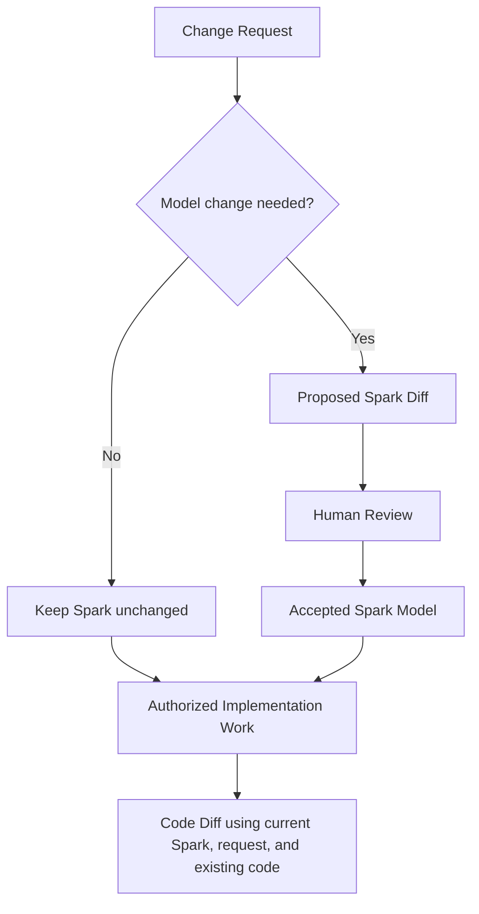
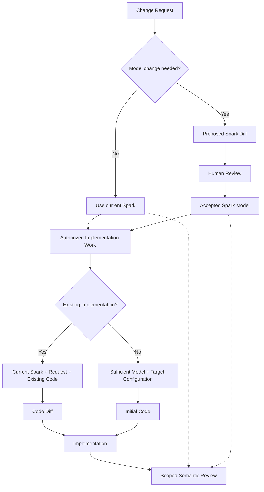

# SparkWell：Brownfield、Descriptive Spark 与 Generative Spark 的完整结论

这轮讨论主要解决了一个之前没有真正想清楚的问题：

> **Spark 与 Existing Code 到底是什么关系？**

尤其是在现有项目中，Spark 不可能简单地成为 Source Code 的镜像，也不应该要求所有 Code 都能够从 Spark 中重新生成。

从一个真实的 `App.tsx` 例子出发，逐渐形成了下面这些结论。

---

# 1. Spark 不是 Source Code 的镜像

例如一个已有 React App 的入口：

```tsx
<ErrorBoundary>
  <DocumentTitle />
  <ClarityInit />
  <SidebarProvider>
    <PermissionSync>
      <VersionUpdateNotification />
      <NoAccessNotification />
      <AppRoutes />
    </PermissionSync>
  </SidebarProvider>
</ErrorBoundary>
```

如果把每个 Component 都机械转换成 Spark：

```text
App
├── ErrorBoundary
├── DocumentTitle
├── ClarityInit
├── SidebarProvider
├── PermissionSync
├── VersionUpdateNotification
├── NoAccessNotification
└── AppRoutes
```

这种 Spark Graph 几乎没有价值。

因为 Source Code 本身已经表达得更准确、更简单。

因此：

> **Spark Graph ≠ Source Tree**

Spark 不应该对应每个 File、Class、Function 或 Component。

---

# 2. Spark 应该提供 Semantic Compression

Spark 的价值应该是把大量 Implementation Detail 压缩成人真正需要理解的软件 Concept。

例如上面的实现可能有 8 个 Components，但人的 Mental Model 可能只有：

```text
Application Runtime
├── Error Handling
├── Permission Management
├── Navigation
└── Global UI State
```

Spark 的判断标准不应该是：

> “这个文件存在吗？”

而应该是：

> **“这个 Concept 是否值得 Engineer 独立理解、讨论、Review 和修改？”**

因此可以引入一个很重要的判断原则：

> **Does this Spark provide semantic compression?**

如果一个 Spark 只是把 Source Code 换一种形式重新描述一次，它大概率不应该存在。

---

# 3. 不是所有 Code Unit 都需要 Spark

对于 `App.tsx` 中的：

```text
DocumentTitle
ClarityInit
VersionUpdateNotification
NoAccessNotification
```

这些很可能只是 implementation details，不需要独立 Spark。

但像：

```text
Permission Synchronization
Application Error Handling
Navigation
```

如果它们具有独立的责任、行为和 Intent，就可能值得成为 Spark。

因此可能存在这样的关系：

```text
Spark                           Implementation

Application Runtime      →     App.tsx

Permission Synchronization
                         →     PermissionSync.tsx
                               usePermissions.ts
                               permissionService.ts

Application Error Handling
                         →     ErrorBoundary.tsx
                               telemetry
                               fallback UI
```

也就是说：

> **一个 Spark 可以对应多个 Files。**

同时：

> **一个 File 也可能参与多个 Sparks。**

Spark 与 Code 不是 1:1 映射。

---

# 4. `ui / logic / service / data` 不应该成为强制分类

真实软件 Concept 往往跨 Implementation Layer。

例如：

```text
Permission Synchronization
```

同时可能涉及：

- UI
- state
- API
- auth
- service
- data

如果强迫它只能选择：

```text
ui
logic
service
data
```

反而会失真。

因此分类不应该决定 Spark 的边界，也不应该强迫概念适应分类。

当前 `spark-type` 已是可选字段；没有合适分类时可以不填。
是否用 `tags` 补充或替代它仍待讨论，本轮不改变分类或 metadata 格式。

而 Spark 真正的重要属性应该是：

```text
Name
Responsibility
Intent
Behavior
Relationships
Implementation Mapping
```

也就是说：

> **Spark 是 Human Cognitive Concept，而不是 Implementation Layer。**

---

# 5. Spark 不应该是 Code 的完整可逆表示

这里出现了一个非常重要的问题：

如果 Spark 比 Code 高层很多，那么它显然没有包含所有 Implementation Detail。

因此不能假设：

```text
Spark → Code
```

可以无损重建现有实现。

如果为了做到这一点，不断把 Implementation Detail 填进 Spark，Spark 最终会变得和 Code 一样复杂。

这样 Spark 就失去意义了。

因此 SparkWell 不应该被设计成一种：

```text
Spark = Source Language
Code = Compiled Output
```

的编译器模型。

---

# 6. Brownfield 项目的正确更新方式

对于现有系统，正确模式不是：

```text
Updated Spark
    ↓
Regenerate Code
```

当设计语义需要变化时，应该是：

```text
Current Spark
    +
Accepted Spark Diff
    +
Existing Code
    ↓
Agent
    ↓
Code Diff
```

这条路径可以简化为：

> **Spark Diff + Existing Code → Code Diff**

但更完整地说，Agent 实际需要的是：

```text
Accepted Change Request
+
Current Spark
+
Accepted Spark Diff (if needed)
+
Implementation Configuration
+
Implementation Mapping (when available)
+
Existing Code
+
Repository Conventions
↓
Code Diff
```

其中：

- Spark 描述 **What / Why**
- Existing Code 描述 **How currently**
- Agent 负责把 semantic change 映射到当前 realization

Spark Diff 可以为空。
CSS 调整、满足既有规则的缺陷修复，或明确授权的重构，都可能只需要修改实现。
缺少 Implementation Map 时，应查找现有代码，而不是认为实现不存在。
模型未描述的实现细节可由现有代码、配置和工程约定提供；只有缺少本次改动必需的语义决定时，才暂停受影响的工作。

因此：

> **Spark controls semantics; Code provides realization context.**

---

# 7. Existing Code 应该默认被保留

Brownfield Change 的基本原则应该是：

> **Preserve existing implementation structure unless the authorized change requires otherwise.**

获准的修改可以来自设计变化，也可以是实现层的修复或调整。
未写进 Spark 的现有行为也应默认保留，不能因此被随意修改。

也就是默认追求：

```text
Minimal Semantic Change
        +
Minimal Structural Disturbance
```

而不是：

```text
New Spark
→ Rewrite implementation
```

这样可以避免 Agent 因为一次小 Requirement：

- 重写 architecture
- 改文件结构
- 改 naming
- 顺手 refactor 大量无关代码

---

# 8. Spark 必须是真实的 Semantic Model

讨论中出现了一个很重要的反例：

假设一个 Spark 里面写的是一篇完全无关的故事。

然后只在最后新增一句：

```text
Permission synchronization failure should support retry.
```

理论上 Agent 仍然可能依靠：

```text
Existing Code + 这一句 Diff
```

正确实现 retry。

但这并不说明 Spark 是有效的。

因为：

> **“能不能用 Spark Diff 生成正确 Code Diff”不能成为 Spark 是否正确的标准。**

Spark 本身必须对当前软件具有真实意义。

---

# 9. Spark 与 Code 应保持 Semantic Consistency

Spark 不需要包含 Code 的所有细节。

例如 Code 可能包含：

```text
React Query
useEffect
retry count
backoff
telemetry
AbortController
cache invalidation
```

Spark 只需要：

```text
Permission Synchronization

- Keeps client permissions aligned with server state.
- Synchronization happens after authentication.
- Failure does not invalidate the current session.
- Retry is supported.
```

这完全可以。

因此：

```text
Code
= semantic behavior
+ implementation details
```

Spark 只保存其中对 Human Understanding 有价值的 semantic knowledge。

但有一个要求：

> **在相同的适用范围和版本内，Code 应符合 Spark 已接受的语义承诺。**

例如 Spark 说：

```text
Cancel discards the draft.
```

但 Code 实际上：

```text
Cancel persists the draft.
```

这说明二者存在语义不一致，但不能直接断定是 Model 错了。
应结合需求和证据判断：修复实现、修正模型，还是澄清适用范围。
不能仅因为代码如此，就自动修改 Spark 来消除差异。

模型也可以保留明确标注的未交付目标，例如 Demo 目前只用内存存储，而持久化仍待实现。
这不等于目标已满足，也不等于模型对当前状态失实。

---

# 10. SparkWell 需要 Model ↔ Code Consistency

因此更准确的关系不是：

```text
Code → Spark → Code
```

而是：

```text
            Spark Model
               ↕
       semantic consistency
               ↕
             Code
```

对于模型所描述、并声明为已实现的语义范围，可以写成：

```text
S ≈ abstraction(C)
```

其中：

- `S` = Spark Model
- `C` = Current Code

不要求 `S` 能重建 `C`。

只要求：

> **S 对这一范围内的 Code 提供可信的 Human-relevant semantic abstraction，而不是覆盖 Code 的全部细节。**

未交付目标和未知内容应明确说明，不能当作当前实现事实代入这个关系。

发生变化：

```text
S + ΔS → S'
C + S' + R → C'
```

其中 `R` 是本次获准的修改请求，`ΔS` 可以为空。

之后仍需在相关的已实现范围内检查：

```text
S' ≈ abstraction(C')
```

---

# 11. SparkWell 需要 Consistency Check

这对应一个重要能力：

> **Spark ↔ Code Consistency Check**

例如：

```text
Spark:
Cancel discards draft.

Code:
Cancel persists draft.

→ Possible inconsistency
```

或者：

```text
Spark:
Permission retry is supported.

Code:
No retry path found.

→ Possible inconsistency
```

反过来也可能发现：

```text
Code introduced a major new behavior
but no related Spark changed.

→ Possible model drift
```

这正面回答了传统 Documentation 最大的问题：

> **文档会不会很快过期？**

SparkWell 的一个核心价值必须是尽量发现这种 drift。

当前已有只读的 [Spark Review Skill](.github/skills/spark-review/SKILL.md)，按指定版本、实现和行为范围检查模型与代码。
它区分有证据支持、可能冲突、明确未交付和证据不足，不自动修改模型、代码或映射。
“没有找到路径”可能只是证据不足；代码新增了未建模行为，也不自动意味着模型错误。
是否需要修改模型，取决于它是否影响应维护的责任、规则或承诺。

CLI 的 `check`、`map check` 只校验结构和引用，trace 负责关联变化，都不能证明语义正确性。
一次审阅也不能保证整个模型可信；结论必须说明已检查的范围和剩余不确定性。

---

# 12. Descriptive 与 Generative 不是完全不同的 Spark 类型

接下来进一步发现：

不是所有 Spark 都完整到足以生成新 Implementation。

以下概念帮助讨论用途和信息是否充分，不是两种新的 Spark Type，也不需要新增 metadata 字段。
是否足以生成实现，需要针对具体目标判断。
同一个 Spark 对 Web 可能已经足够，对 iOS 仍可能不足；判断也会随模型内容的演进而变化。
必要时用普通文字说明覆盖范围和限制即可。

## Descriptive Spark

主要目标：

> **可信地描述所选范围内的重要 semantic knowledge。**

例如：

```text
Permission Synchronization

Responsibility:
Keep effective client permissions aligned with server state.

Important behavior:
- Synchronization happens after authentication.
- Failure does not invalidate current session.

Implementation:
- PermissionSync.tsx
- usePermissions.ts
- permissionService.ts
```

在它覆盖的范围内，它可以用于：

- Human Understanding
- Review
- Spark Diff
- Change Traceability
- Agent Context
- Test Case Generation
- Change Impact reasoning

但不一定完整到可以：

```text
Spark → 从零生成完整 iOS App
```

---

## Generative Spark

对于指定的新实现目标，Generative Spark 包含足够的软件语义，并结合相关模型、实现配置和工程约定来启动实现。
共享语义尽量保持 platform-neutral，但足够支持一个目标并不代表足够支持所有平台。

例如：

```text
Todo Editing

- Editing uses a draft.
- Save validates and commits.
- Cancel discards.
- Save failure preserves the draft.
- Validation rules...
```

这种 Spark 可能足够用于：

```text
             Spark
          /    |    \
         ↓     ↓     ↓
       Web    iOS  Android
```

因此：

> **Generative = contains enough semantic information to bootstrap a specified realization within an agreed scope.**

---

# 13. Generative 不是永久 Type，而是一种 Capability

进一步讨论后发现：

`descriptive` / `generative` 描述模型用途和针对某个目标的信息充分程度，而不是永久分类或需要存储的状态。

针对一个目标，模型可以逐渐补充：

```text
Descriptive
    ↓
逐渐补充
    ↓
Enough to bootstrap that target
```

代码变化后，应先判断是否影响模型所描述的语义：

```text
Code Change
    ↓
Check Modeled Semantics
    ├── Unchanged → Spark may remain unchanged
    └── Possible conflict → Review evidence and scope
```

发现不一致后：

```text
Possible Inconsistency
    ↓
Review Model, Code, and Scope
    ↓
Approved Code Fix or Model Update
    ↓
Recheck Relevant Semantics
```

恢复的是对应范围内的语义一致性，不自动证明模型足够完整，也不自动恢复某种生成保证。
纯实现细节变化不必触发模型更新，更不能仅因手工改过代码就判定生成能力失效。

因此：

> **Generative is a target-dependent capability, not a permanent type or a correctness guarantee.**

## 初始来源与正文组织

Spark 可以由人或 Agent 根据既有代码提炼，也可以先设计再实现。
来源不决定当前能力：最初从代码创建的 Spark，之后也可能通过设计流程补充新的行为承诺。

既有实现的重要行为可以成为当前设计基线，不需要先有 Spark 才构成约定。
提炼时仍应区分重要语义、实现机制、已知局限和疑似缺陷，再通过正常模型评审确认。
正文照常按责任、行为、规则和协作组织，不要求 `Observed` 等特殊章节，也不增加独立维护流程。
必要的平台范围、证据和不确定性可以直接用文字说明。

如果初始来源值得提醒读者，可以使用可选的 `Note`，例如：

```markdown
## Note

本 Spark 最初基于既有代码创建，后续按正常设计流程演进。
它不保证完整还原原有代码；后续修改应结合现有实现。
是否足以生成新实现，需要针对具体目标判断。
```

这是示例文案，可以改写、缩短或省略，不是固定模板或必填章节。
它说明初始来源和使用边界，不降低正文中已接受规则的约束力，也不要求 Skills 对标题做特殊处理。
可复用示例放在[建模指南](.sparkwell/design-modeling-guide.md)，无需单独模板文件或 metadata。

---

# 14. Trustworthiness 与 Completeness 是两个维度

这两个概念必须分开。

## Trustworthiness

回答：

> Spark 是否对自己声明的范围诚实、可信，区分了当前行为、已接受的承诺、未交付目标和未知内容？

## Completeness

回答：

> 当前模型结合实现配置和工程约定，是否足以启动指定范围的新 realization？

于是存在：

| | 对指定目标信息不足 | 对指定目标信息充分 |
|---|---|---|
| **所述语义有证据支持** | 可支持理解与局部演进 | 可作为该目标的启动依据，仍需验证 |
| **存在冲突或证据不足** | 先处理相关问题 | 信息充分也不能代替语义核验 |

这很重要，因为：

> 一个 Spark 可以在声明的范围内可信，但仍不足以生成 iOS。

例如：

```text
Application Runtime
```

可以准确描述已检查的 Web 应用职责。

但它没有描述完整 UI、interaction、state lifecycle 等，因此仍然：

```text
reviewed claims = supported
sufficient to bootstrap iOS = not established
```

这些是针对范围和目标的判断，不是需要写入 Spark 的布尔字段。

---

# 15. 所有 Spark 都应该 Trustworthy，但不一定 Generative

可以形成一个非常重要的原则：

> **All Sparks should be trustworthy.  
> Not all Sparks need to be generative.**

中文：

> **允许一个模型不够全面，但要求它对自己声明的范围诚实、可信。**

这让 SparkWell 不需要为了“可生成”而把所有细节都塞进 Model。

---

# 16. 人可以直接手工修改 Code

SparkWell 不应该要求：

> “以后只能改 Spark，不能直接改 Code。”

真实软件工程里，人仍然可以：

```text
Engineer
    ↓
Manually edit Code
    ↓
Code Diff
```

然后 SparkWell 可以做：

```text
Code Diff
    ↓
Agent analyzes semantic change
    ↓
Compare with current Spark
    ↓
Review Findings
    ├── No maintained meaning changes → Keep Spark unchanged
    ├── Implementation defect → Propose code fix
    └── Model change needed → Proposed Spark Diff → Human Review
```

因此变化可以从两边发起：

```text
Spark → Code
Code → Spark
```

更准确的原则是：

> **Change can originate from either the model or the implementation; SparkWell helps keep them semantically synchronized.**

---

# 17. 不是所有 Code Change 都需要回写 Shared Spark

进一步又发现：

即使手工修改 Code，也不一定需要修改 Shared Spark。

例如：

```text
Shared Spark:
Todo Editing

- Save commits draft.
- Cancel discards draft.
```

Web 中加入：

```text
Double-click title enters edit mode.
```

这可能只是 Web-specific interaction。

这不意味着 iOS 必须提供相同手势。

因此不应把该 Web-specific interaction 自动变成 shared semantic model 的要求。

---

# 18. Shared Semantics 与 Platform-specific Realization Knowledge 要区分

更合理的结构是：

```text
             Shared Spark
            /     |      \
           /      |       \
        Web      iOS    Android
     realization realization realization
```

Shared Spark 保存：

```text
platform-independent semantics
```

例如：

```text
Editing can be entered.
Cancel discards uncommitted changes.
Save commits changes.
```

Web-specific knowledge 可以是：

```text
Double-click title enters edit mode.
```

iOS-specific knowledge 可以是：

```text
Tap Edit button enters edit mode.
```

因此：

> **Not every implementation change is a shared model change.**

而应该判断：

```text
Is this:
1. Shared semantic change?
2. Platform-specific realization change?
3. Pure implementation detail?
```

影响已维护共享语义的变化，需要更新 Shared Spark。
平台特有的重要行为可以在明确限定范围的 Artifact 中维护；普通实现选择可放在目标 guidance 或现有工程约定中。
这不要求新的模型层，也不要求记录全部实现细节。

---

# 19. Generative Spark 也不应该每次重新生成全部 Code

这是另一个重要结论。

即使 Spark 是 Generative，也不能假设每次重新生成都会得到完全相同的 Code。

Agent 可能改变：

- 文件拆分
- naming
- local abstraction
- library usage
- state placement
- formatting
- helper structure

因此：

> **Generative 不等于 deterministic regeneration。**

Generative 的真正含义是：

> **Spark 对特定目标和范围提供足够的软件语义，结合实现配置启动新 realization，再通过实现验证检查结果。**

---

# 20. Bootstrap 与 Evolution 应该采用不同模式

对于一个全新的 platform realization，在相关语义与目标配置足够明确时：

```text
Sufficient Spark Model + Target Configuration
      ↓
Generate from scratch
      ↓
New iOS / Web / Android implementation
```

这叫：

> **Bootstrapping a realization**

但一旦 realization 已经存在，之后不应该不断重新生成。

应该使用：

```text
Current Spark + Change Request + Optional Spark Diff
    +
Existing Web Code
    ↓
Web Code Diff
```

或者：

```text
Current Spark + Change Request + Optional Spark Diff
    +
Existing iOS Code
    ↓
iOS Code Diff
```

因此：

> **Generation is for bootstrapping.  
> Diff-based transformation is for evolution.**

---

# 21. Spark 负责 Semantic Stability，Code 负责 Realization Stability

这是这轮讨论里很重要的一个总结。

```text
Spark
→ semantic stability

Existing Code
→ realization stability
```

Spark 保证：

- Concept
- Intent
- Important behavior
- Relationships
- Semantic constraints

长期稳定。

Existing Code 保留：

- architecture choices
- file structure
- platform conventions
- optimizations
- implementation details
- human refinements

长期连续。

于是：

```text
Current Spark
    +
Change Request + Optional Spark Diff
    +
Existing Code
    ↓
Minimal Code Diff
```

就成为更合理的演进方式。

---

# 22. Descriptive Spark 仍然解决大部分 SparkWell 原始问题

即使一个 Spark 不能从零生成完整 Implementation，它仍然可以解决很多原来的问题。

| 问题 | Descriptive Spark 是否适用 |
|---|---|
| Human Mental Model | 是 |
| Agent 对 Requirement 理解偏差 | 是 |
| Spark Diff Review | 是 |
| PR 中解释 Code Change 原因 | 是 |
| Requirement → Spark → Code Traceability | 是 |
| Test Case Diff | 是 |
| Context / Intent Preservation | 是 |
| Knowledge Reuse | 是 |
| Black-box Implementation | 是 |
| Engineer Expertise 沉淀 | 是 |
| Change Impact reasoning | 是 |
| Many Views | 是 |
| Many Realizations | 不一定 |
| 从零生成完整新 Platform | 不一定 |

因此 Generative 并不是 SparkWell 存在的必要条件。
表中的“适用”表示这些工作可以利用有限模型，不代表现有工具已自动完成它们，也不代表对未建模部分有完整覆盖。

---

# 23. SparkWell 的主要价值需要重新表述

之前容易说：

> Spark 是一个更高层的模型，可以生成 Code。

现在更准确的是：

> **Spark 是一层长期、可信、Human-oriented 的 semantic software model。**

它可以用于：

```text
Understand
Review
Change
Explain
Trace
Validate
Generate
```

其中 `Generate` 是其中一个能力，而不是唯一价值。

更进一步：

> **Spark 是 Human 和 Agent 围绕软件语义进行沟通的共同层。**

---

# 24. Greenfield 与 Brownfield 的工作流

## Greenfield

如果模型对本次目标与范围足够完整：

```text
Requirement
    ↓
Spark Graph
    ↓
Human Review
    ↓
Generate Initial Implementation with Target Configuration
```

例如 Todo Demo。

---

## Brownfield

现有系统更现实的流程：

```text
Existing Code
    ↓
Agent-assisted abstraction
    ↓
Candidate Sparks
    ↓
Human Review
    ↓
Accepted Spark Model
```

当前可以由人和 Agent 按具体情况完成抽象，使用 `/spark-design` 提案、确认并维护模型，不要求独立的自动 Brownfield 建模工具。
模型确认后，可在另行授权的映射维护范围内给未修改的既有代码补充 [Implementation Map](.sparkwell/implementation-map.md)。
现有 `map show`、`map check`、`map update` 已支持查看、校验、预览和定向写入；先审阅关联，再用 `--write` 保存。
映射表达代码与模型的关联，不证明代码历史上由该模型生成，也不证明实现完整或正确。

之后的 Change：



设计流程可以以“模型无需修改”结束，但这不代表实现无需修改。
实现仍需要自己的授权范围，不能因模型已确认而自动开始。

如果人直接改 Code：

```text
Manual Code Diff
    ↓
Semantic Analysis
    ↓
Compare with Applicable Model Commitments
    ├── No modeled change needed → Keep Spark unchanged
    ├── Implementation defect → Propose code fix
    └── Model change needed → Propose Spark Diff for review
```

---

# 25. 最终的统一模型

这轮讨论之后，SparkWell 更准确的模型可以表达为：



输入还包括相关配置、映射和工程约定，详见第 6 节。
审阅发现差异后，再决定是否修实现、修模型或澄清范围，不自动让任何一方迁就另一方。

而手工修改 Code 也可以进入同一个 Loop：

```text
Manual Code Change
        ↓
Semantic Analysis
        ↓
Compare with Applicable Model Commitments
     ├── No modeled change needed → Keep Spark unchanged
     ├── Implementation defect → Propose code fix
     └── Model change needed → Proposed Spark Diff → Human Review
```

---

# 26. 当前最重要的设计原则

可以把这轮讨论最终压缩成这些原则。

### Spark Graph ≠ Source Tree

不要机械映射 File / Class / Component。

### Semantic Compression

Spark 必须比 Code 更容易建立 Mental Model。

### Human Cognitive Boundary

Spark 的边界由“人是否值得把它作为独立 Concept 理解”决定。

### Trustworthy First

模型可以不全面，但必须对自己声明的范围诚实、可信。

### Generative Is Optional

不是所有 Spark 都必须完整到可以生成新 Implementation。
信息是否足够取决于目标和范围，不需要新的 metadata 分类。

### Spark Is Not a Compiler IR

Spark 不需要完整表达所有 implementation semantics。

### Existing Code Matters

Brownfield Change 应该基于：

```text
Current Spark + Change Request + Existing Code → Code Diff
```

需要模型变化时纳入已接受的 Spark Diff；否则 Spark 可以保持不变。

### Preserve Realization Continuity

已有实现默认保持结构稳定，只做必要修改。

### Model and Code Must Stay Semantically Consistent

Spark 与 Code 可以包含不同粒度的信息，但不能在共有语义上矛盾。
发现差异时按证据判断修复哪一方，并区分明确未交付的目标和未知内容。

### Change Can Start From Either Side

既可以：

```text
Spark → Code
```

也可以：

```text
Code → Spark
```

### Not Every Code Change Is a Shared Spark Change

要区分：

```text
Shared semantic change
Platform-specific realization change
Implementation-only change
```

### Generation for Bootstrap, Diff for Evolution

新平台可以从针对目标足够完整的模型和配置初始化，结果仍需验证。

已有平台后续应该：

```text
Current Spark + Change Request + Existing Code → Code Diff
```

### Spark Stabilizes Meaning; Code Stabilizes Realization

Spark 负责长期语义。

Code 负责具体实现连续性。

---

# 27. 一句话总结

这轮讨论之后，SparkWell 不再应该被理解成：

> **“用 Spark 替代 Code，或者从 Spark 重建 Code。”**

更准确的是：

> **SparkWell 在 Code 之上维护一层可信、面向人的 Semantic Model；Spark 保存软件的 Concept、Intent 和重要行为，Code 保存具体 Realization。模型可以不全面，但应对声明范围诚实、可信；新实现按目标判断信息是否足够，已有实现结合当前模型、获准的修改请求和现有代码增量演进，必要时更新 Spark，并通过有证据、有范围的审阅检查二者的语义一致性。**

这个模型既允许：

```text
One Model → Many Realizations
```

也允许：

```text
Existing Realization → Stable Evolution
```

同时避免把 Spark 变成另一份比 Source Code 更复杂的 Documentation。